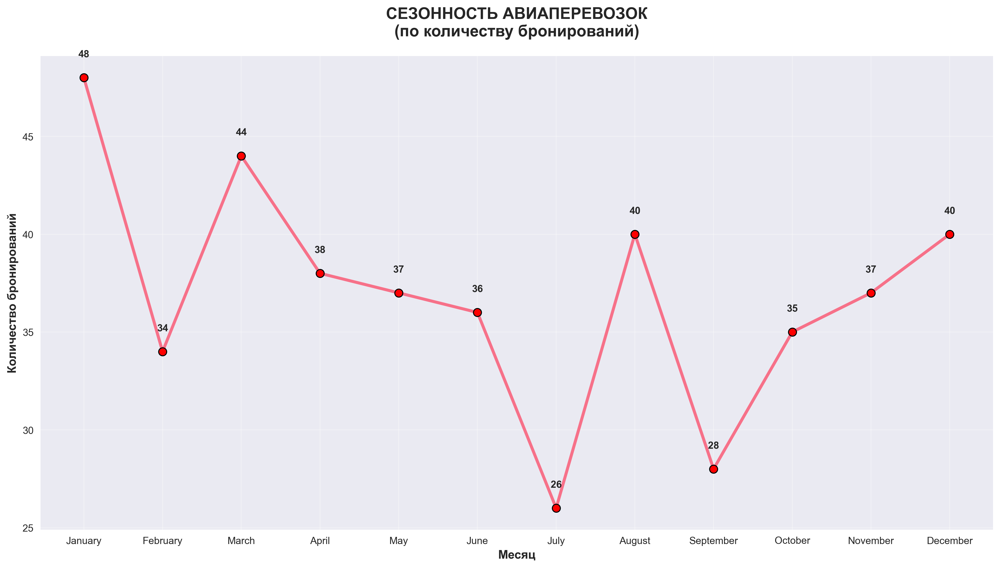
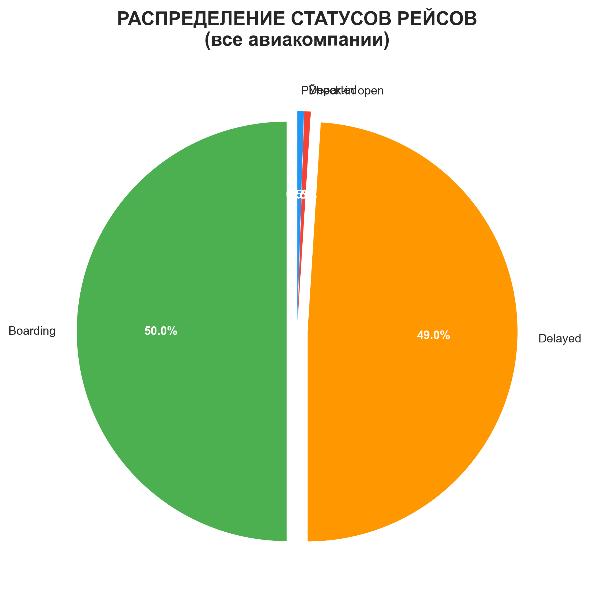
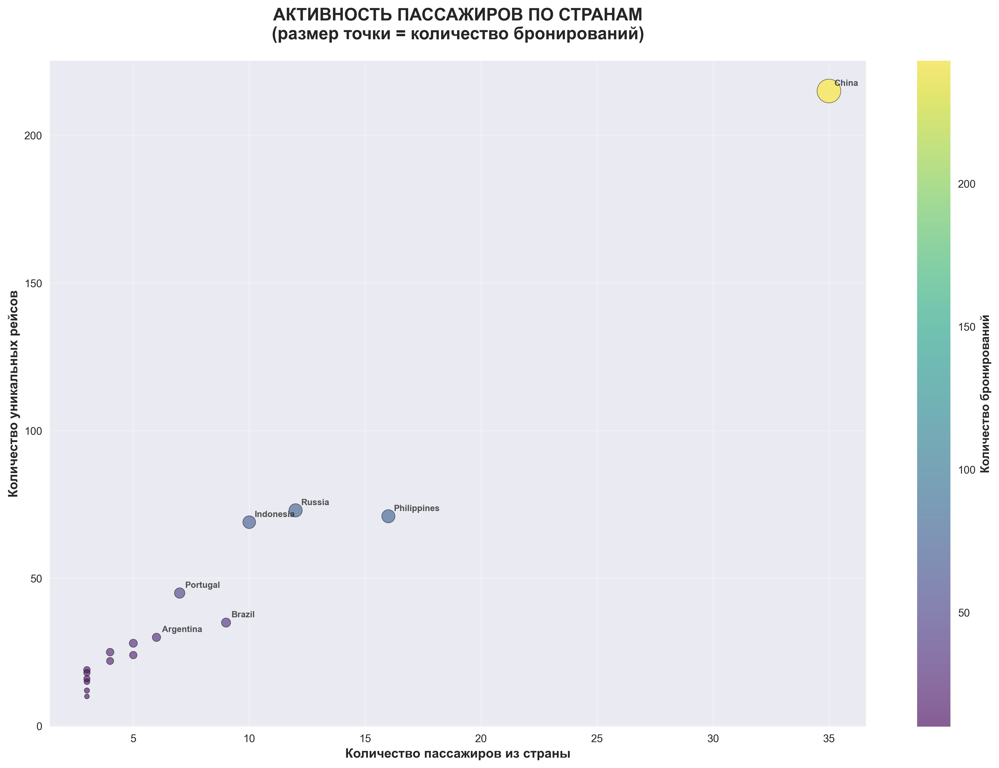
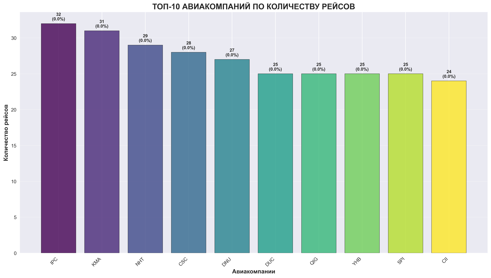
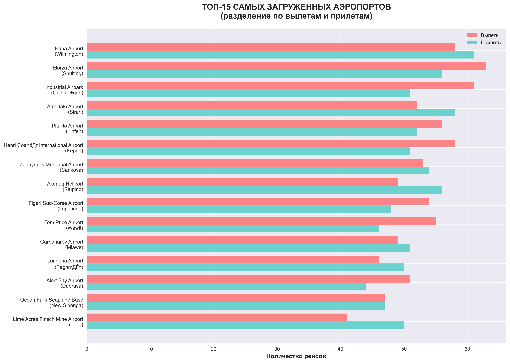
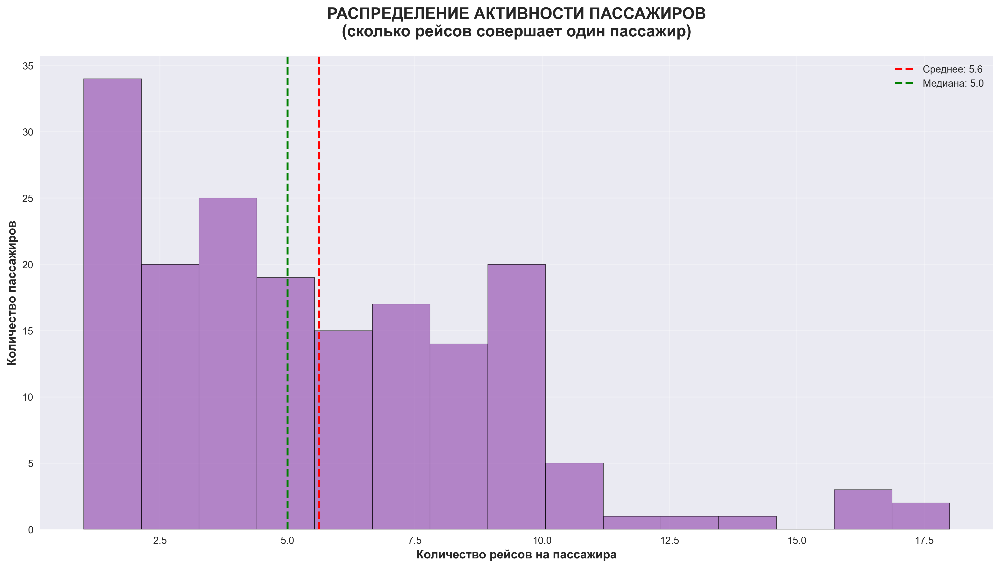

# ✈️ Airport Analytics & Visualization

Аналитика авиаперевозок на Python + PostgreSQL: генерация многостраничного Excel‑отчёта, пакет статичных визуализаций (Matplotlib/Seaborn) и интерактивные дашборды (Plotly) с ползунком по времени.

> Быстрый старт: установите зависимости, укажите доступ к БД и запустите скрипты — все артефакты сложатся в папки `exports/` и `charts/`.

---

## 🔍 Что умеет проект

- **Комплексный Excel‑отчёт** с форматированием: KPI авиакомпаний, трафик аэропортов, активность пассажиров, сезонность, топ‑маршруты. Файл создаётся в `exports/airport_analytics_report_<timestamp>.xlsx`.
- **6 наглядных графиков** в папке `charts/` (png, 300 DPI):
  - распределение статусов рейсов (pie)
  - топ‑10 авиакомпаний по количеству рейсов (bar)
  - топ‑15 загруженных аэропортов: вылеты/прилёты (stacked horizontal bar)
  - сезонность бронирований по месяцам (line)
  - гистограмма активности пассажиров
  - активность по странам: пассажиры × уникальные рейсы (scatter)
- **Интерактивные дашборды (Plotly)**: анимация по месяцам, сравнение авиакомпаний, динамика статусов. Есть **демо‑режим**, если подключение к БД недоступно.

---

## 🗂️ Структура репозитория (рекомендуемая)

```
.
├── db.py                         # Генерация форматированного Excel‑отчёта (exports/)
├── import.py                     # Пакет статичных графиков (charts/)
├── airport_timeline.py           # Интерактивные анимированные графики (Plotly)
├── exports/                      # Автоматом создаётся при экспорте Excel‑отчётов
├── charts/                       # Автоматом создаётся при рендеринге изображений
└── README.md
```

---

## 🛠️ Требования

- Python 3.10+
- PostgreSQL 13+ и доступ к базе с таблицами: `flights`, `airline`, `airport`, `passengers`, `booking`, `booking_flight`

**Зависимости Python**

```
psycopg2-binary
pandas
numpy
matplotlib
seaborn
openpyxl
plotly
```

## ⚙️ Конфигурация подключения к БД

Во всех скриптах по умолчанию используются параметры:
```
host=localhost
database=airport_db
user=postgres
password=farida
port=5432
```
Измените значения внутри соответствующих файлов под вашу среду или вынесите их в переменные окружения и импортируйте в код.

---

## ▶️ Запуск

### 1) Excel‑отчёт (OpenPyXL + продвинутое форматирование)

```bash
python db.py
```
- На выходе: `exports/airport_analytics_report_<timestamp>.xlsx` c листами:
  1. Эффективность авиакомпаний (KPI, пунктуальность, отмены, средняя длительность)
  2. Трафик аэропортов (вылеты/прилёты, авиакомпании)
  3. Активность пассажиров (по странам)
  4. Месячная статистика (тренды и активность)
  5. Популярность маршрутов (топ направлений)

### 2) Пакет статичных графиков (Matplotlib/Seaborn)

```bash
python import.py
```
- На выходе: папка `charts/` с изображениями:
  - `pie_chart_status_distribution.png`
  - `bar_chart_top_airlines.png`
  - `hbar_chart_busiest_airports.png`
  - `line_chart_seasonality.png`
  - `histogram_passenger_activity.png`
  - `scatter_country_activity.png`

### 3) Интерактивные графики (Plotly с анимацией)

```bash
python airport_timeline.py
```
- Откроются интерактивные окна/вкладки браузера с ползунком по месяцам.  
- Если подключения к БД нет, автоматически запустится **демо‑режим** с реалистичными синтетическими данными.

---

## 🖼️ Примеры визуализаций

> Появятся после запуска скриптов из раздела «Запуск».

| Сезонность бронирований | Распределение статусов | Активность по странам |
|---|---|---|
|  |  |  |

| Топ‑10 авиакомпаний | Топ‑15 аэропортов | Активность пассажиров |
|---|---|---|
|  |  |  |

---

## 📊 Что внутри отчётов и графиков

- **KPI авиакомпаний**: всего рейсов, пунктуальность (%), задержки/отмены, средняя длительность рейса (часы).
- **Трафик аэропортов**: уникальные рейсы, вылеты/прилёты, количество авиакомпаний.
- **Активность пассажиров**: бронирования, уникальные рейсы, средние значения на пассажира (по странам проживания).
- **Сезонность**: тренд бронирований по месяцам, активность пассажиров/рейсов.
- **Популярные маршруты**: топ направлений с количеством рейсов, авиакомпаний и средним временем в пути.

---

## 🧪 Отладка

- Проверьте доступ к БД и валидность схемы/данных.
- Убедитесь, что `matplotlib` не блокируется backend‑ом (на сервере лучше сохранять в файл, что и делает код).
- Если графики Plotly не открываются автоматически, сохраните фигуры как HTML (`fig.write_html`) и откройте в браузере.

---

## 📌 Дорожная карта (optional)

- Параметризация подключения к БД через `.env`
- Автогенерация `requirements.txt`/`poetry.lock`
- Экспорт Plotly‑дашбордов в HTML
- CI‑проверки (ruff, black, mypy)
- Docker‑compose для БД + приложения

---

## 📜 Лицензия

MIT — используйте и развивайте проект свободно.


---
